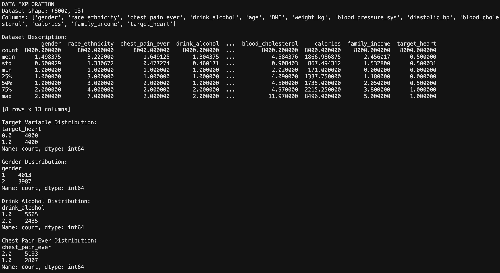
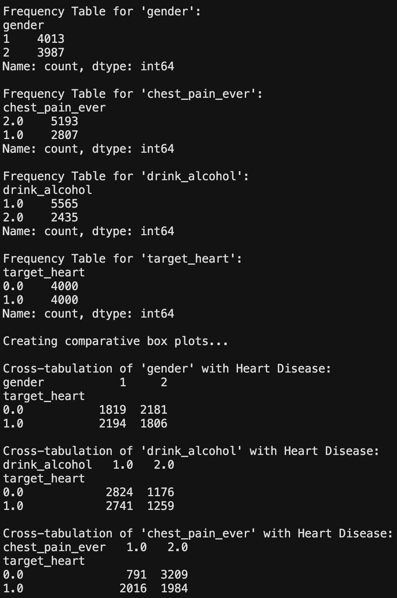
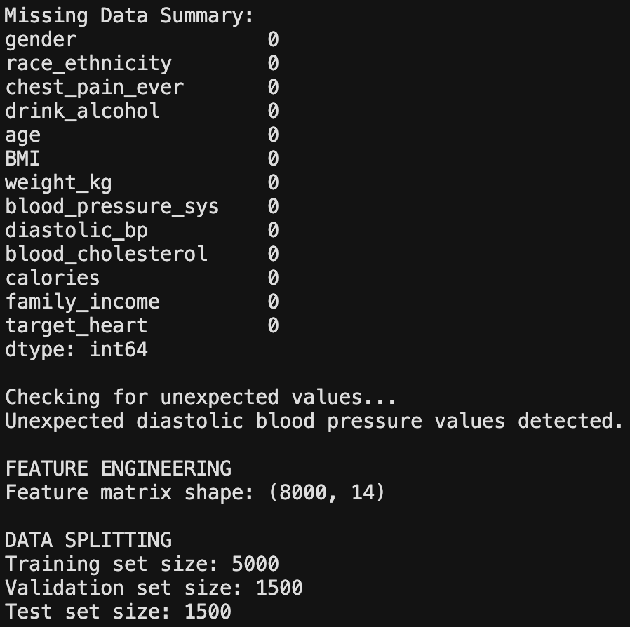
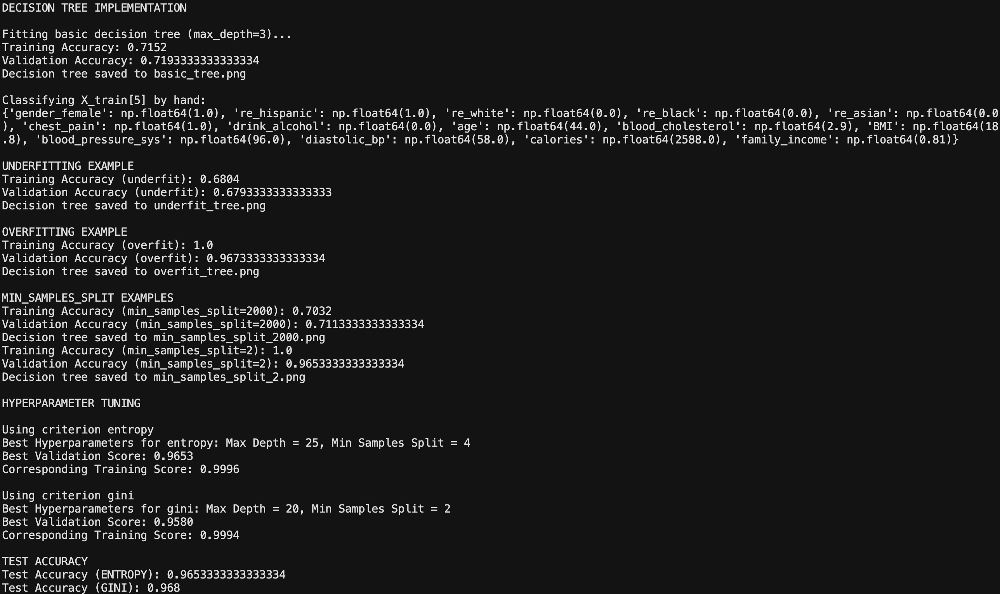
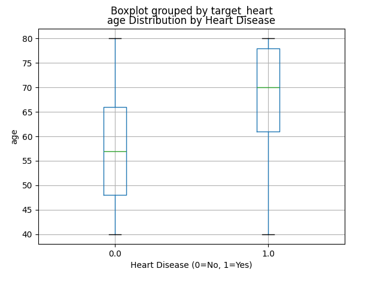
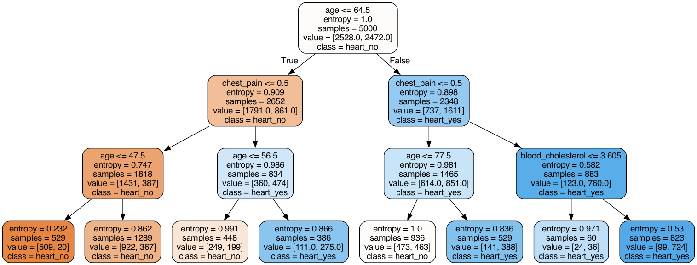
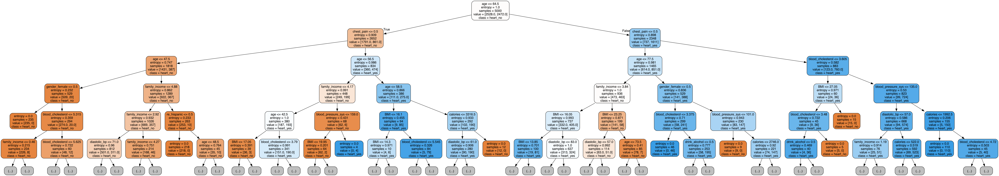
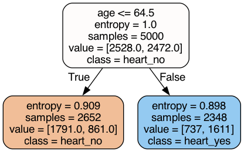

# Decision Trees and Accuracy-based Diagnostics

This project demonstrates the use of **decision trees** to analyze a health dataset and explore hyperparameter tuning for optimal classification performance.

## Overview

This lab explores:
- Data exploration and visualization of health survey data
- Feature engineering and preprocessing
- Decision tree implementation using **scikit-learn**
- Hyperparameter tuning and model evaluation
- Understanding overfitting and underfitting

## Dataset

- Source: [NHANES Heart Disease CSV](https://www.cs.toronto.edu/~lczhang/311/lab02/NHANES-heart.csv)
- Shape: `(8000, 13)`  
- Target Variable: `target_heart` (0 = no heart disease, 1 = heart disease)
- Features include demographics, health metrics, and lifestyle factors such as gender (1=male, 2=female), race_ethnicity, age, drink_alcohol (1=yes, 2=no), blood_cholesterol, blood_pressure_sys, BMI, and chest_pain_ever(1=yes, 2=no).

## Key Findings

- **Age** is the most informative predictor for heart disease
- **Chest pain** and **gender** also show meaningful differences between groups
- The balanced dataset (50/50 split) helps prevent bias toward the majority class
- Optimal hyperparameters: `max_depth=25`, `min_samples_split=4` for entropy criterion
- Final test accuracy: ~96.5% with entropy criterion

## Outputs
**Data Exploration**

**Decision Tree Implementation**

## Visualizations

- Box plots of numerical features.
- Comparative box plots by heart disease target.
- Decision tree PNGs.

**Sample Box Plot**

**Basic Tree**

**Overfitting Tree**

**Underfitting Tree**

